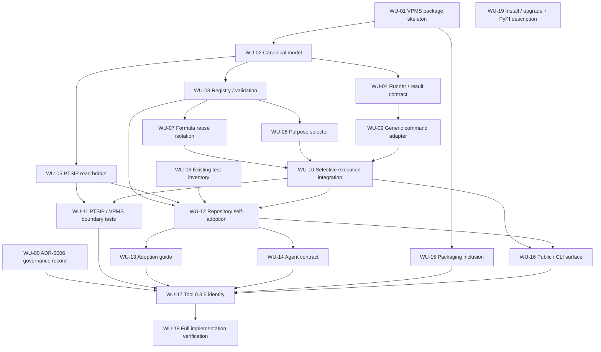

# PTSIP Tool 0.3.5 — VPMS Introduction Plan

> **Status:** APPROVED FOR IMPLEMENTATION PREPARATION  
> **Target Tool version:** `0.3.5`  
> **Planning baseline:** `293dbb7119c7668a0b729ecf90b165669c96719b`  
> **Current released Tool baseline:** `0.3.4`  
> **Primary goal:** introduce VPMS as an independent verification-purpose management subsystem while preserving PTSIP architectural ownership responsibilities.  
> **Branch state:** this plan is intentionally committed to `main` before the Tool `0.3.5` implementation branch is created.  
> **Release-note state:** no `releasenote/0.3.5.md` is created during planning; it is created only at the Tool `0.3.5` release boundary.

## 1. Naming decision

The former working name `TVFM (Test Verification Function Management)` is retired before implementation.

Tool `0.3.5` adopts the name:

```text
VPMS
Verification Purpose Management System
```

VPMS is broader than test-function management. It manages the purpose, composition, selection, and execution of verification work while allowing verification mechanisms to be reused without collapsing Product and Toolchain verification purposes.

The defining question is:

```text
PTSIP
    What is this component?

VPMS
    Why does this verification exist?
```

PTSIP and VPMS share the same purpose-first philosophy but govern different responsibilities.

```text
PTSIP
    Purpose precedes reuse.

VPMS
    Verification purpose precedes reuse and execution.
```

VPMS is not a fourth PTSIP architecture classification and does not replace PTSIP conformance evaluation.

## 2. Problem statement

Long-lived repositories commonly accumulate validation logic under one broad `tests/` surface. Product behavior tests, development-tool verification, migration checks, repository automation checks, compatibility checks, and policy assertions may then be executed together even when only one responsibility changed.

This creates three problems:

1. execution scope grows with repository age even when a change affects only one responsibility;
2. a test's original purpose becomes difficult to recover from its path or implementation alone;
3. shared verification logic encourages accidental purpose collapse when reuse is treated as more important than lifecycle responsibility.

PTSIP already distinguishes Product and Toolchain ownership. Tool `0.3.5` extends the purpose-first principle into verification management without making ordinary test files Product runtime artifacts.

## 3. Test SDK ownership and verification purpose are different axes

Verification code is normally development-time tooling: it is generally not Product-runtime-required and is not distributed as Product functionality. Under PTSIP such verification implementations will commonly remain `TOOLCHAIN` components.

VPMS therefore MUST NOT reinterpret the verification implementation's PTSIP classification as its verification purpose.

Example:

```text
verification implementation
    PTSIP classification = TOOLCHAIN

verification purpose
    VPMS purpose = PRODUCT

meaning
    a Toolchain-owned verifier protects Product behavior
```

Another verifier may be:

```text
verification implementation
    PTSIP classification = TOOLCHAIN

verification purpose
    VPMS purpose = TOOLCHAIN

meaning
    a Toolchain-owned verifier protects development tooling
```

The initial VPMS purpose set for Tool `0.3.5` is deliberately limited to:

```text
PRODUCT
TOOLCHAIN
```

No additional `BOUNDARY`, `SHARED`, or pseudo-plane purpose is introduced in 0.3.5 unless later evidence proves it necessary. Cross-boundary architecture correctness remains a PTSIP concern and may be targeted by verification cases without creating another PTSIP Plane.

## 4. Purpose classification principle

VPMS purpose is determined by the responsibility whose correctness would be lost if the verification were absent or failing.

The primary questions are:

```text
Why was this verification created?

What changed that requires this verification?

If this verification disappears, whose correctness can no longer be established?

Does failure indicate a Product behavior defect or a Toolchain/development-process defect?
```

Compilation or package inclusion MAY be useful evidence, but MUST NOT be the sole rule. PTSIP and VPMS must remain applicable to interpreted applications, web applications, scripts, configuration-driven systems, serverless systems, and other repositories where a conventional compilation boundary does not exist.

## 5. Core VPMS model

The Tool `0.3.5` target model is:

```text
                    PTSIP
                      |
                      v
               What is this?
             +--------+--------+
             |                 |
          PRODUCT          TOOLCHAIN
                      |
                      | target metadata / stable contract
                      v
                    VPMS
                      |
                      v
             Why verify this?
             +--------+--------+
             |                 |
          PRODUCT          TOOLCHAIN
          purpose           purpose
             |                 |
             +--------+--------+
                      |
                      v
              Verification Case
                      |
          +-----------+-----------+
          |           |           |
          v           v           v
       Formula     Variables     Policy
          |           |           |
          +-----------+-----------+
                      |
                      v
                    Runner
```

The minimum semantic units are:

- **Verification Purpose** — why the verification exists: `PRODUCT` or `TOOLCHAIN`;
- **Verification Case** — the purpose-bound executable verification unit;
- **Formula** — purpose-neutral reusable verification logic or invariant;
- **Variables** — mutable test inputs, fixtures, field sets, constants, and case data;
- **Policy** — intentionally governed expectations whose change represents a policy/contract decision rather than ordinary fixture drift;
- **Runner** — the execution adapter or command used to perform the selected case.

## 6. Reuse contract

VPMS exists specifically to allow reuse without erasing purpose.

The default reuse boundary is the Formula layer.

A Formula SHOULD be reusable across Product and Toolchain verification when it expresses an invariant that remains meaningful without knowing which purpose consumes it.

Good Formula characteristics:

```text
- does not need to know PRODUCT or TOOLCHAIN;
- does not hard-code a specific project component identity;
- does not embed mutable expected values;
- does not silently embed Product or Toolchain policy;
- evaluates supplied inputs according to a stable verification rule.
```

A useful decision test is:

> Would this verification logic still make sense if all Product and Toolchain names were removed from the repository context?

If yes, it is a Formula candidate. If no, it belongs in purpose-owned Variables, Policy, Case configuration, or purpose-specific execution logic.

Cross-purpose Formula reuse is permitted. Cross-purpose Policy reuse is not assumed by default because Policy carries governed intent. A shared implementation MUST NOT cause two distinct verification obligations to become one implicit purpose.

## 7. Verification Case is the execution unit

VPMS MUST treat a Verification Case, not a source test file, as the smallest purpose-bound execution unit.

Conceptually:

```yaml
id: product.api.required-fields
purpose: PRODUCT

target:
  component: api-sdk

formula:
  ref: structural.required_fields

variables:
  ref: product/variables/fields.yaml

policy:
  ref: product/policy/api.yaml

runner:
  adapter: command
```

A case binds purpose, target, Formula, Variables, Policy, and Runner. This allows one Formula to be reused by multiple Product or Toolchain cases while retaining independent purpose and policy meaning.

## 8. Reference repository layout

VPMS MUST NOT require Consumer Repositories to adopt one directory topology. PTSIP's repository-layout neutrality remains intact.

For projects that intentionally choose a structured VPMS layout, the recommended reference form is:

```text
tests/
├─ formula/
│  ├─ schema/
│  ├─ numeric/
│  ├─ structure/
│  └─ lifecycle/
│
├─ product/
│  ├─ variables/
│  │  ├─ fields.yaml
│  │  ├─ constants.yaml
│  │  └─ cases.yaml
│  ├─ policy/
│  └─ cases/
│
└─ toolchain/
   ├─ variables/
   │  ├─ fields.yaml
   │  ├─ constants.yaml
   │  └─ cases.yaml
   ├─ policy/
   └─ cases/
```

This topology is a reference organization, not a PTSIP/VPMS conformance requirement.

`cases/` is intentionally a sibling of `policy/`, not a child of it:

```text
Formula   = how to verify
Variables = mutable verification data
Policy    = what outcome/contract is intentionally governed
Case      = how purpose + target + formula + variables + policy + runner are bound
```

## 9. Implementation ownership and source-tree separation

Tool `0.3.5` intentionally introduces VPMS as a sibling subsystem rather than a nested `ptsip.tvfm` or `ptsip.vpms` package.

Target source layout:

```text
src/
├─ ptsip/
│  └─ existing PTSIP implementation
│
└─ vpms/
   └─ VPMS implementation
```

Reasons:

1. PTSIP policy, authority, adoption, and conformance work can continue without waiting for VPMS implementation;
2. VPMS can evolve its verification model without forcing frequent modification of PTSIP internals;
3. parallel development has a lower source-level conflict surface;
4. PTSIP and VPMS govern different semantic boundaries even though VPMS may consume PTSIP component metadata;
5. current setuptools package discovery already scans `src`, so a sibling package does not require a nested ownership model merely for packaging convenience.

## 10. Dependency-direction rule

The most important implementation boundary is:

```text
PTSIP core
    MUST NOT depend on VPMS
```

The prohibited architecture is:

```text
PTSIP <----> VPMS
```

because it would recreate the development bottleneck that source-tree separation is intended to remove.

VPMS MAY consume stable PTSIP-owned information such as component identity or classification through an explicit contract boundary. It SHOULD NOT import unstable PTSIP internal implementation modules merely for convenience.

Preferred direction:

```text
PTSIP
  |
  | stable project/component data contract
  v
VPMS
```

PTSIP must remain fully usable for classification, conformance, adoption, gate, resolve, and authority operations when VPMS is absent or disabled.

## 11. Runner independence

VPMS MUST NOT become a pytest-specific manager.

The model must be capable of representing verification implemented by tools such as:

```text
pytest
unittest
Jest / Vitest
Pester
cargo test
go test
schema validators
static analyzers
shell/PowerShell commands
project-specific validators
```

Tool `0.3.5` SHOULD start from the smallest reusable runner abstraction needed by the implementation, with a generic command runner preferred over prematurely implementing many framework-specific adapters.

Framework adapters may be added only when a concrete requirement justifies them.

## 12. Selective execution requirement

The reason VPMS exists is not only classification but execution-scope control.

Tool `0.3.5` MUST make Product-purpose and Toolchain-purpose verification independently selectable.

Conceptual behavior:

```text
Product change
    -> select PRODUCT-purpose Verification Cases

Toolchain change
    -> select TOOLCHAIN-purpose Verification Cases

release / explicit full verification
    -> select both purpose sets
```

The implementation MUST NOT require a full repository test run merely because Product and Toolchain cases share a Formula implementation.

Exact CLI naming is an implementation decision for the 0.3.5 branch and must preserve VPMS independence rather than forcing VPMS semantics into unrelated existing PTSIP commands.

## 13. PTSIP conformance boundary

VPMS execution result and PTSIP conformance outcome are separate claims.

```text
VPMS PRODUCT verification PASS
    !=
PTSIP CONFORMANT
```

and:

```text
PTSIP CONFORMANT
    !=
Product functional verification PASS
```

VPMS may provide verification evidence to a later integration boundary, but Tool `0.3.5` MUST NOT silently redefine ordinary VPMS case success as PTSIP architectural conformance.

## 14. 0.3.5 implementation phases after branch split

### Phase A — VPMS skeleton and model

Create the independent `src/vpms/` package and define the minimum data model for Verification Purpose, Verification Case, Formula reference, Variables reference, Policy reference, and Runner reference.

Acceptance condition: importing or removing VPMS does not change PTSIP core behavior.

### Phase B — Registry and validation

Implement deterministic loading/validation of VPMS verification definitions. Reject unknown purposes and malformed case bindings. Keep validation focused on VPMS semantics rather than duplicating PTSIP conformance logic.

Acceptance condition: valid and invalid verification definitions produce deterministic machine-readable results.

### Phase C — Formula and purpose-preserving reuse

Implement Formula registration/reference rules and verify that one Formula can serve multiple cases without merging their purpose, Variables, or Policy state.

Acceptance condition: Product and Toolchain cases can share a Formula yet remain independently selectable.

### Phase D — Selection

Implement purpose-based case selection. Selection logic must operate on Verification Case metadata, not directory-name heuristics alone.

Acceptance condition: selecting Product purpose does not automatically execute Toolchain-purpose cases, and vice versa.

### Phase E — Runner execution

Implement the minimum generic execution path required to run selected cases and report case-level outcomes.

Acceptance condition: execution preserves case identity, purpose, target, and result without converting failures into PTSIP classification decisions.

### Phase F — PTSIP metadata boundary

Where VPMS needs PTSIP target metadata, introduce the smallest stable read contract necessary. Avoid bidirectional imports and avoid changing PTSIP core behavior solely to simplify VPMS internals.

Acceptance condition: the dependency direction remains PTSIP data -> VPMS consumer, never PTSIP core -> VPMS runtime dependency.

### Phase G — selective verification and regression

Add tests proving Product-only, Toolchain-only, shared-Formula, malformed-definition, and full-selection behavior. Run existing PTSIP regression tests to prove the sibling subsystem does not regress Tool `0.3.4` functionality.

## 15. Pre-branch preparation boundary

The following work is intentionally performed on `main` before the Tool `0.3.5` branch exists:

1. record the VPMS name and responsibility decision;
2. record this Tool `0.3.5` implementation plan;
3. remove completed historical planning documents whose released outcomes are already retained under `releasenote/`;
4. retain future planning such as `planning/0.4.0.md`;
5. verify the resulting `main` revision and use it as the Tool `0.3.5` branch point.

The following work is explicitly deferred until after branch separation:

```text
src/vpms/ implementation
adoption/ VPMS guidance
agents/ VPMS agent contract changes
decisions/ VPMS governance/ADR changes
specification-level VPMS normative expansion
PTSIP/VPMS integration implementation
Tool version bump
CLI/packaging implementation changes
```

## 16. Protected directories during pre-branch preparation

Before the Tool `0.3.5` branch is created, this preparation MUST NOT modify:

```text
adoption/
agents/
decisions/
```

Those directories describe established PTSIP behavior and governance. VPMS does not yet have an implementation baseline against which those documents can be safely updated.

## 17. Release-note policy

`releasenote/0.3.5.md` MUST NOT be created during planning or early implementation.

The release note is produced only when Tool `0.3.5` reaches its explicit release boundary and the delivered behavior can be described from verified implementation evidence rather than from intent.

Historical release notes remain the durable record of completed released versions. Completed planning documents may therefore be removed once their released outcome is already preserved there.

## 18. Non-goals for Tool 0.3.5

Tool `0.3.5` does not initially aim to:

- create a fourth PTSIP Plane or architecture classification;
- classify verification purpose solely from directory names;
- treat compilation as the universal Product boundary;
- require Consumer Repositories to reorganize all tests into the reference layout;
- make pytest or another single test framework mandatory;
- merge Product and Toolchain Policy merely because they share a Formula;
- make PTSIP core depend on VPMS;
- replace PTSIP conformance with VPMS functional verification;
- expand `adoption/`, `agents/`, or `decisions/` before the VPMS implementation branch exists;
- create a release note before release evidence exists;
- expand unrelated PTSIP authority or distributed-coordination behavior.

## 19. Branch-split readiness criteria

The Tool `0.3.5` implementation branch may be created from `main` only after all of the following are true:

1. the name `VPMS — Verification Purpose Management System` is recorded — **required**;
2. `planning/0.3.5.md` exists on `main` — **required**;
3. completed historical planning already covered by release notes is removed — **required**;
4. `planning/0.4.0.md` remains intact — **required**;
5. `adoption/`, `agents/`, and `decisions/` remain unchanged during preparation — **required**;
6. no `releasenote/0.3.5.md` exists — **required**;
7. no VPMS implementation or Tool version bump is mixed into the preparation commit sequence — **required**;
8. the final `main` SHA is re-read from GitHub and used as the exact branch baseline — **required**.

After these conditions pass, the dedicated Tool `0.3.5` branch is authorized for implementation.

## 20. Post-branch implementation baseline

The pre-branch readiness conditions have now been satisfied and the implementation branch has been created:

```text
branch
    tool-0.3.5-vpms

exact branch point
    be787a932f7c5262b95dcb1ff25c101e4569a454
```

From this point forward, VPMS implementation work belongs on `tool-0.3.5-vpms`. The `main` branch retains the durable signal that Tool `0.3.5` and VPMS are planned, while implementation evidence is accumulated on the dedicated branch.

The implementation branch may now modify `src/vpms/`, `adoption/`, `agents/`, and `decisions/` according to the boundaries below. `releasenote/0.3.5.md` remains deferred until the explicit release boundary.

## 21. Concrete `src/vpms/` package plan

The initial package SHOULD be deliberately small but responsibility-complete. The target structure is:

```text
src/
├─ ptsip/
│  └─ existing PTSIP core
│
└─ vpms/
   ├─ __init__.py
   ├─ model.py
   ├─ registry.py
   ├─ selector.py
   ├─ runner.py
   ├─ ptsip_bridge.py
   └─ adapters/
      ├─ __init__.py
      └─ command.py
```

Each module exists for one explicit responsibility:

- `model.py` — canonical VPMS data types and validation-independent semantic identities;
- `registry.py` — deterministic loading, indexing, reference resolution, and structural validation of VPMS definitions;
- `selector.py` — purpose-based Verification Case selection without relying on directory-name heuristics;
- `runner.py` — execution orchestration and normalized case-level results;
- `ptsip_bridge.py` — the only intended VPMS-facing boundary for reading stable PTSIP target metadata;
- `adapters/command.py` — the initial generic command runner so VPMS is not coupled to pytest or another framework.

Additional modules MUST NOT be added merely to mirror conventional framework structure. New files require a distinct responsibility that cannot be cleanly represented by the initial modules.

The initial implementation does not require a VPMS-specific CLI module before the model, registry, selector, and runner semantics are proven. CLI naming remains a separate surface decision so that implementation convenience does not accidentally collapse VPMS back into PTSIP core commands.

## 22. Canonical VPMS implementation data model

The first implementation must make the semantic distinctions in Sections 5–7 concrete.

At minimum, `model.py` should represent:

```text
VerificationPurpose
    PRODUCT | TOOLCHAIN

VerificationCase
    id
    purpose
    target reference
    formula reference
    variables reference
    policy reference
    runner reference

VerificationResult
    case identity
    purpose
    target identity
    execution outcome
    diagnostics / failure detail
```

Formula, Variables, Policy, and Runner references SHOULD remain explicit rather than being flattened into one opaque command definition. Flattening would make it impossible to preserve the reuse boundary that VPMS exists to protect.

The following rules are mandatory for the initial model:

1. `purpose` is explicit and limited to `PRODUCT` or `TOOLCHAIN`;
2. missing purpose is not inferred from path, test framework, filename, compilation status, or package location;
3. VPMS does not duplicate the target component's PTSIP classification as a second independently editable VPMS field;
4. Formula identity is distinct from Verification Case identity;
5. Policy identity is distinct from Variables identity;
6. two cases that reuse one Formula retain independent purpose, Variables, Policy, target, and result identities;
7. execution result does not mutate PTSIP classification or Decision Authority state.

A malformed or unresolved definition must fail explicitly rather than being silently assigned to one purpose.

## 23. PTSIP bridge and dependency isolation

`ptsip_bridge.py` exists to make the dependency direction visible and auditable rather than allowing arbitrary VPMS modules to import PTSIP internals.

Target dependency shape:

```text
PTSIP stable data
       |
       v
ptsip_bridge.py
       |
       v
VPMS model / selection
```

The bridge may expose only the target information VPMS actually needs, such as stable component identity and resolved architectural classification. It MUST be read-oriented for Tool `0.3.5`.

The bridge MUST NOT:

- cause PTSIP core to import VPMS;
- write Project Profile classifications merely because a verification case runs;
- create or resolve PTSIP Decision Authority records for a VPMS purpose decision;
- treat a VPMS `PRODUCT` purpose as proof that the verifier implementation itself is a PTSIP Product component;
- make PTSIP conformance depend on VPMS availability.

If a stable PTSIP read contract is insufficient, the smallest public read surface may be introduced on the PTSIP side. Such a change must remain useful without VPMS and must not introduce `ptsip -> vpms` dependency.

## 24. Registry, selection, and execution flow

The implementation target is:

```text
verification definitions
        |
        v
      Registry
  load / validate / resolve
        |
        v
      Selector
 choose explicit purpose scope
        |
        v
 Verification Cases
        |
        +---- Formula refs
        +---- Variables refs
        +---- Policy refs
        +---- Runner refs
        |
        v
       Runner
        |
        v
 case-level results
```

The registry owns definition integrity; the selector owns execution scope; the runner owns execution. These responsibilities MUST NOT be collapsed into one function that discovers files, guesses purpose, and immediately executes them.

Selection rules for Tool `0.3.5`:

```text
PRODUCT selection
    -> PRODUCT-purpose cases only

TOOLCHAIN selection
    -> TOOLCHAIN-purpose cases only

explicit full selection
    -> union of both purpose sets
```

Shared Formula usage does not create an implicit selection dependency. A Product case and Toolchain case that use the same Formula remain separately selectable.

The initial generic command adapter should accept only the execution information required to run a case and return normalized result data. Framework-specific adapters are deferred until a concrete requirement cannot be met by the generic command boundary.

## 25. Existing `tests/` transition plan

Tool `0.3.5` must prove VPMS against the repository's real verification inventory rather than only synthetic examples.

Migration begins with classification by verification purpose, not a bulk directory move.

For this repository specifically:

```text
PTSIP package / distributed Tool behavior
    -> repository Product responsibility
    -> PRODUCT-purpose verification candidate

repository-only migration, release, workflow,
maintenance, or development automation
    -> Toolchain responsibility
    -> TOOLCHAIN-purpose verification candidate
```

This is repository-relative. It does not mean that PTSIP is a Product component inside every Consumer Repository; it means the distributed PTSIP Tool is the Product produced by the PTSIP repository itself.

The transition sequence is:

1. inventory existing tests and identify the responsibility each test protects;
2. assign VPMS purpose from that responsibility;
3. identify genuinely purpose-neutral Formula candidates;
4. separate mutable Variables from governed Policy where current tests mix them;
5. register Verification Cases without requiring an immediate physical move of every existing test file;
6. prove Product-only and Toolchain-only selection;
7. retain an explicit full-suite path for regression and release verification;
8. reorganize physical test directories only where the move produces a clear maintenance benefit.

Directory movement MUST NOT be used as a substitute for semantic classification.

## 26. `adoption/` change plan

After the VPMS model, registry, selector, and runner behavior are implemented and tested, `adoption/ADOPTION-GUIDE.md` should be extended from implemented behavior rather than aspiration.

The VPMS adoption section must explain:

- VPMS is optional and does not become a prerequisite for adopting PTSIP;
- how to answer `Why does this verification exist?` before selecting a purpose;
- how `PRODUCT` and `TOOLCHAIN` verification purposes differ from the verifier implementation's PTSIP classification;
- compilation/package inclusion as evidence, not a universal classification rule;
- the Formula / Variables / Policy / Verification Case / Runner distinction;
- why Formula may be reused across purposes while Policy is not implicitly shared;
- the reference `tests/formula`, `tests/product`, and `tests/toolchain` layout without making it mandatory;
- how an existing repository can adopt VPMS incrementally without immediately moving every test;
- how purpose-selective verification reduces unnecessary execution scope;
- that VPMS PASS does not imply PTSIP `CONFORMANT`, and PTSIP `CONFORMANT` does not imply functional verification PASS.

The adoption guide MUST NOT document a command surface that has not been implemented and verified on the branch.

## 27. `agents/` change plan

After machine-readable VPMS semantics and diagnostics exist, `agents/AGENT-CONTRACT.md` should gain VPMS-specific agent obligations.

An agent that creates, modifies, reuses, selects, or executes verification must follow these rules:

1. determine verification purpose before reuse or execution decisions;
2. do not infer purpose solely from `tests/` path, framework, file extension, compile inclusion, or naming convention;
3. identify the responsibility that would lose correctness evidence if the verification disappeared;
4. reuse a Formula across Product and Toolchain purposes only when the Formula is genuinely purpose-neutral;
5. do not silently merge, copy, or normalize Product and Toolchain Policy merely to reduce duplication;
6. treat governed Policy changes differently from ordinary Variables/fixture updates;
7. do not silently edit Policy to make a failing verification pass;
8. preserve purpose when selecting a subset of verification cases;
9. do not convert VPMS purpose into PTSIP component classification;
10. do not create PTSIP Decision Authority history merely to resolve a VPMS verification-purpose ambiguity;
11. when purpose cannot be established from available project evidence, surface the ambiguity rather than guessing;
12. do not reorganize the Consumer Repository into the reference VPMS directory layout unless the project intentionally adopts that layout.

Agent guidance should prefer stable machine-readable VPMS case metadata over path heuristics once VPMS definitions exist.

## 28. `decisions/` governance plan

VPMS introduces an architectural responsibility boundary significant enough to require an ADR, but the decision history should not be fragmented into unnecessary records.

The initial branch should add one focused ADR:

```text
decisions/
└─ ADR-0006-establish-vpms-verification-purpose-management.md
```

ADR-0006 should record at least:

- retirement of the TVFM working name;
- adoption of `VPMS — Verification Purpose Management System`;
- the distinction between PTSIP classification and VPMS verification purpose;
- the initial purpose set `PRODUCT | TOOLCHAIN`;
- Verification Case as the purpose-bound execution unit;
- Formula as the default cross-purpose reuse boundary;
- Variables and Policy as different change/governance categories;
- `src/vpms/` as a sibling of `src/ptsip/`;
- the rule that PTSIP core does not depend on VPMS;
- VPMS's read-only initial relationship to PTSIP component metadata;
- separation of VPMS execution result from PTSIP conformance;
- repository-layout neutrality and the non-mandatory status of the reference test layout.

Existing ADRs should not be rewritten to retroactively insert VPMS. Additional VPMS ADRs should be created only when a later decision is independently consequential—for example a future CLI/public contract or authority model that cannot be treated as an implementation detail.

## 29. Work units and dependency graph

Tool `0.3.5` progress is tracked by stable **Work Unit IDs**. Session labels are operational checkpoints for reporting and review; they are **not** hard sequencing constraints. The `Depends on` relation is authoritative.

A Work Unit MAY begin as soon as all of its dependencies are `COMPLETE`, even when another Work Unit with an earlier or later Session label is still open. Independent Work Units SHOULD be allowed to proceed in parallel when doing so does not increase source-level conflict risk.

### 29.1 Status vocabulary

The planning table uses the following states:

```text
READY       no unmet dependency; implementation may start
PLANNED     defined, but one or more dependencies are incomplete
IN_PROGRESS currently being implemented or verified
BLOCKED     dependencies are satisfied but another explicit blocker exists
COMPLETE    completion gate passed and evidence is recorded
```

`Session` is a progress label. `Work Unit` is the durable unit of work. If a later implementation session needs to combine, split, or reorder work for efficiency, the Work Unit IDs and dependency meaning remain stable.

### 29.2 Work Unit table

| Work Unit | Session | Responsibility / primary output | Depends on | Completion gate | Initial status | Evidence |
| --- | --- | --- | --- | --- | --- | --- |
| `WU-00` | `S0` | Governance record: add `ADR-0006-establish-vpms-verification-purpose-management.md` | — | ADR records VPMS name, responsibility boundary, reuse rule, sibling source ownership, and one-way PTSIP relationship without rewriting previous ADRs | `COMPLETE` | ADR commit `9599f63eb680dab0b295e4aa20264aeae3ed4e2f` |
| `WU-01` | `S0` | Create independent `src/vpms/` package skeleton and isolation baseline | — | VPMS can be imported/removed without changing PTSIP core behavior; no `ptsip -> vpms` dependency exists | `COMPLETE` | skeleton `52b1fa57d6ac275295416ca1819a53f889281edd`; isolation test `9d12692dfc7ffd7c81fb054ce80cfad6bfca50c1`; isolated VPMS import/syntax smoke PASS; branch-point comparison shows no `src/ptsip/` changes |
| `WU-02` | `S1` | Canonical VPMS model: `VerificationPurpose`, `VerificationCase`, references, `VerificationResult` | `WU-01` | purpose is explicit; Formula/Variables/Policy/Runner identities remain distinct; model tests pass | `COMPLETE` | model commit `577102d1e63fdb5610dabe3e0537e2ebae166ebf`; `python -m pytest -q tests/test_vpms_model_035.py` -> `6 passed` |
| `WU-03` | `S2` | Registry and definition validation in `registry.py` | `WU-02` | valid/invalid definitions and unresolved references produce deterministic machine-readable diagnostics | `COMPLETE` | registry commit `552ef340691ea1078f25bb0aa553a8a5c958332e`; `python -m pytest -q tests/test_vpms_registry_035.py` -> `8 passed` |
| `WU-04` | `S2` | Framework-neutral runner and normalized result contract in `runner.py` | `WU-02` | runner result preserves case/purpose/target identity and cannot mutate PTSIP classification state | `COMPLETE` | runner commit `fe62b2ce1cc0b55fd49ff8238b201424963bd796`; `python -m pytest -q tests/test_vpms_runner_035.py` -> `7 passed`; committed blobs match tested blobs |
| `WU-05` | `S2` | Read-only PTSIP metadata bridge in `ptsip_bridge.py` | `WU-02` | stable target metadata is consumable through one narrow direction; no authority/profile write path exists | `READY` | — |
| `WU-06` | `S0` | Inventory existing repository tests by the responsibility they protect | — | each inventoried test has recorded Product/Toolchain purpose evidence or an explicit unresolved note; no bulk move is required | `READY` | — |
| `WU-07` | `S3` | Formula registration/reuse and purpose-isolation semantics | `WU-03` | Product and Toolchain cases may share a Formula without sharing purpose, Variables, Policy, or result identity | `READY` | — |
| `WU-08` | `S3` | Purpose-based selector in `selector.py` | `WU-03` | `PRODUCT`, `TOOLCHAIN`, and explicit full selection are deterministic and path heuristics are not authoritative | `READY` | — |
| `WU-09` | `S3` | Generic command adapter in `adapters/command.py` | `WU-04` | command-backed cases execute through the normalized runner contract without pytest-specific coupling | `READY` | — |
| `WU-10` | `S4` | End-to-end selective execution integration | `WU-07`, `WU-08`, `WU-09` | Product-only, Toolchain-only, and full case sets execute independently while shared Formula use remains non-coupling | `PLANNED` | — |
| `WU-11` | `S4` | PTSIP/VPMS boundary integration tests | `WU-05`, `WU-10` | tests prove no `ptsip -> vpms` runtime dependency, no authority mutation, no classification mutation, and no conformance/result collapse | `PLANNED` | — |
| `WU-12` | `S5` | Repository self-adoption: register representative real Verification Cases from the existing test inventory | `WU-03`, `WU-05`, `WU-06`, `WU-10` | real repository Product-purpose and Toolchain-purpose subsets are demonstrated; full regression path remains available | `PLANNED` | — |
| `WU-13` | `S6` | Update `adoption/ADOPTION-GUIDE.md` from implemented VPMS behavior | `WU-12` | every documented VPMS behavior has an implemented/tested counterpart and the reference layout remains optional | `PLANNED` | — |
| `WU-14` | `S6` | Update `agents/AGENT-CONTRACT.md` with VPMS purpose-first obligations | `WU-03`, `WU-10`, `WU-12` | agent rules bind to real VPMS metadata/diagnostics; no path-only purpose inference or silent Policy repair is permitted | `PLANNED` | — |
| `WU-15` | `S2` | Packaging inclusion for sibling `vpms` package | `WU-01` | source distribution and wheel include VPMS without changing existing PTSIP command behavior | `READY` | — |
| `WU-16` | `S6` | Decide and implement the minimum required public/CLI surface | `WU-10`, `WU-12` | public surface reflects proven VPMS semantics and introduces no unnecessary PTSIP-core coupling | `PLANNED` | — |
| `WU-17` | `S7` | Tool `0.3.5` version/identity stabilization | `WU-00`, `WU-11`, `WU-13`, `WU-14`, `WU-15`, `WU-16` | delivered VPMS surface, documentation, packaging, and governance are stable enough for the `0.3.5` identity | `PLANNED` | — |
| `WU-18` | `S8` | Full regression, build, installed-wheel, and implementation-completion verification | `WU-17` | all Section 30 acceptance criteria are reproducibly verified; release note remains deferred until explicit release preparation | `PLANNED` | — |
| `WU-19` | `S9` | Align PTSIP install/upgrade guidance and the PyPI project-description source | — | `README.md` and `README.ko.md` clearly distinguish new installation (`python -m pip install PTSIP`) from upgrade (`python -m pip install --upgrade PTSIP`); `README.md`, which is the configured project readme, carries the same guidance into the next distribution's PyPI long description; work is complete before branch merge | `READY` | — |

### 29.3 Session checkpoints

Sessions group related work for progress reporting, but do not replace the dependency graph.

| Session | Tracking purpose | Work Units | Parallelism expectation |
| --- | --- | --- | --- |
| `S0` | Governance, isolation baseline, and repository discovery | `WU-00`, `WU-01`, `WU-06` | These are independent roots and MAY proceed in parallel |
| `S1` | Semantic model lock | `WU-02` | Begins after `WU-01`; establishes the shared VPMS semantic vocabulary |
| `S2` | Independent infrastructure foundations | `WU-03`, `WU-04`, `WU-05`, `WU-15` | Registry, runner, bridge, and packaging work SHOULD remain independently owned where practical |
| `S3` | Purpose-preserving behavior components | `WU-07`, `WU-08`, `WU-09` | Formula semantics, selector, and command adapter MAY proceed in parallel once their own dependencies are complete |
| `S4` | Execution and architectural-boundary integration | `WU-10`, `WU-11` | `WU-11` follows integrated execution and the bridge; do not collapse it into ordinary runner tests |
| `S5` | Repository self-adoption | `WU-12` | Applies proven VPMS semantics to real PTSIP repository tests |
| `S6` | Adoption/agent/public-surface alignment | `WU-13`, `WU-14`, `WU-16` | These MAY proceed in parallel after their individual dependencies are satisfied |
| `S7` | Tool identity stabilization | `WU-17` | Version identity is delayed until implementation/documentation/public surface are stable |
| `S8` | Implementation-completion verification | `WU-18` | Final reproducible regression/build/wheel gate before explicit release preparation |
| `S9` | Pre-merge installation / PyPI description alignment | `WU-19` | Independent user-facing distribution guidance; MAY be completed whenever convenient but MUST be complete before branch merge |

No rule requires every Work Unit in `S2` to finish before an eligible `S3` Work Unit starts. For example, `WU-07` and `WU-08` depend on `WU-03`, not on the PTSIP bridge or packaging work. Likewise, `WU-09` depends on the runner contract, not on Registry completion.

### 29.4 Dependency graph



The graph expresses implementation dependencies, not file ownership. Work Units without an incoming edge are deliberately independent roots. An edge MUST NOT be added merely because two tasks are expected to occur in nearby calendar sessions; it should exist only when the downstream work cannot be completed correctly without the upstream result.

### 29.5 Progress recording protocol

Every implementation session should identify the active work before modification begins, using a stable notation such as:

```text
Active Session: S2
Active Work Unit: WU-04 — Runner / result contract
Branch: tool-0.3.5-vpms
```

When a Work Unit reaches its completion gate, the table in Section 29.2 should be updated from `IN_PROGRESS` to `COMPLETE` and the `Evidence` column should record the relevant commit SHA, PR, test command/result, or other reproducible verification reference.

A Work Unit that cannot proceed despite completed dependencies should be marked `BLOCKED` with the blocker recorded in `Evidence`. A whole Session MUST NOT be called complete merely because one Work Unit in that Session is complete.

At the current implementation state, immediately eligible work includes:

```text
WU-05  read-only PTSIP metadata bridge
WU-06  existing test inventory
WU-07  Formula registration / reuse isolation
WU-08  purpose selector
WU-09  generic command adapter
WU-15  packaging inclusion
WU-19  install / upgrade + PyPI description alignment
```

`WU-09` became eligible when `WU-04` completed. `WU-05` remains eligible from `WU-02`; `WU-07` and `WU-08` remain eligible from `WU-03`; `WU-15` remains eligible from `WU-01`; `WU-06` and `WU-19` remain independent roots. Their relative order is not an architectural dependency.

## 30. Tool 0.3.5 implementation acceptance criteria

Before `tool-0.3.5-vpms` is considered implementation-complete, all of the following must hold:

1. `src/vpms/` exists as an independently owned sibling package;
2. PTSIP core contains no runtime dependency on VPMS;
3. the only initial VPMS purposes are `PRODUCT` and `TOOLCHAIN`;
4. Verification Case is the purpose-bound execution unit;
5. Formula reuse across purposes preserves independent case purpose, Variables, Policy, and results;
6. missing/ambiguous purpose is not guessed from directory or framework heuristics;
7. Product-purpose and Toolchain-purpose cases can be selected independently;
8. an explicit full-selection path remains available;
9. runner semantics are framework-neutral and at least the generic command adapter is verified;
10. PTSIP metadata consumption is one-way and read-oriented through a narrow bridge;
11. VPMS execution does not mutate PTSIP classification or Decision Authority state;
12. VPMS result and PTSIP conformance remain separate claims;
13. representative existing repository tests are classified and exercised through VPMS semantics;
14. `adoption/ADOPTION-GUIDE.md` reflects implemented VPMS adoption behavior;
15. `agents/AGENT-CONTRACT.md` reflects implemented VPMS agent obligations;
16. ADR-0006 records the VPMS architecture/governance decision without rewriting earlier ADR history;
17. existing PTSIP regressions continue to pass;
18. build and installed-wheel verification include the sibling VPMS package without breaking existing PTSIP commands;
19. no unrelated PTSIP authority/coordination expansion is mixed into the VPMS implementation;
20. `releasenote/0.3.5.md` is created only when explicit release preparation begins.

## 31. Pre-merge installation/upgrade and PyPI description guidance

`WU-19` is intentionally independent from `WU-18`. It has low implementation coupling and MAY be completed before or after other implementation Work Units. Its ordering is therefore not represented as an implementation dependency.

The binding requirement is instead a branch boundary:

> `WU-19` MUST be `COMPLETE` before `tool-0.3.5-vpms` is merged.

The user-facing installation guidance must distinguish the two intents explicitly:

```powershell
# New installation
python -m pip install PTSIP

# Upgrade to the latest available release
python -m pip install --upgrade PTSIP
```

`README.ko.md` should communicate the same distinction in Korean while preserving the same commands.

`pyproject.toml` configures:

```toml
[project]
readme = "README.md"
```

Therefore `README.md` is also the source for the distribution long description that PyPI renders for the uploaded PTSIP release. `WU-19` must ensure the upgrade guidance is present in that source before the release artifact is built/published. The live PyPI project page changes only when a new distribution carrying that metadata is uploaded; `WU-19` does not require or justify a standalone release by itself.
